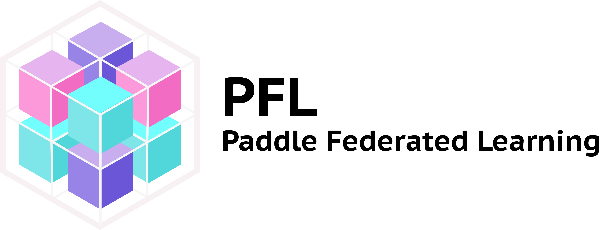
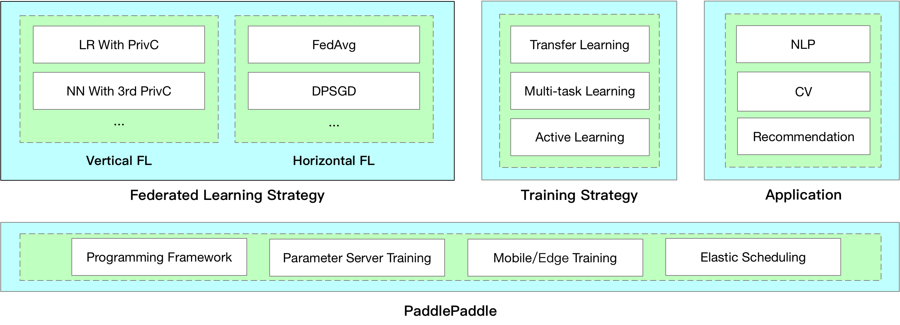
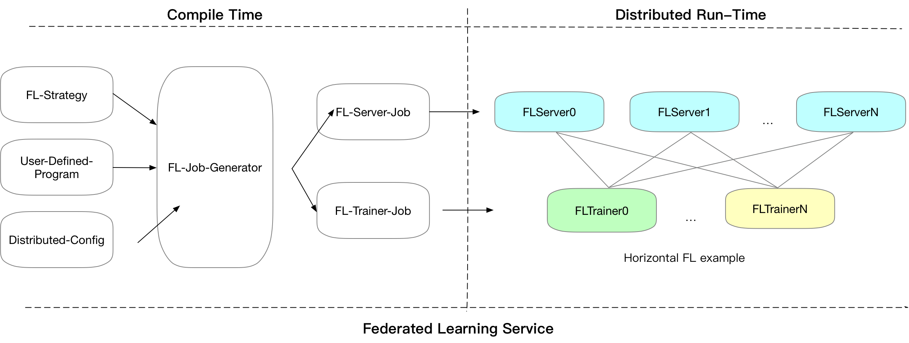

[DOC](https://paddlefl.readthedocs.io/en/latest/) | [Quick Start](https://paddlefl.readthedocs.io/en/latest/instruction.html) | [中文](./README_cn.md)

PaddleFL is an open source federated learning framework based on PaddlePaddle. Researchers can easily replicate and compare different federated learning algorithms with PaddleFL. Developers can also benefit from PaddleFL in that it is easy to deploy a federated learning system in large scale distributed clusters. In PaddleFL, serveral federated learning strategies will be provided with application in computer vision, natural language processing, recommendation and so on. Application of traditional machine learning training strategies such as Multi-task learning, Transfer Learning in Federated Learning settings will be provided. Based on PaddlePaddle's large scale distributed training and elastic scheduling of training job on Kubernetes, PaddleFL can be easily deployed based on full-stack open sourced software.

## Federated Learning

Data is becoming more and more expensive nowadays, and sharing of raw data is very hard across organizations. Federated Learning aims to solve the problem of data isolation and secure sharing of data knowledge among organizations. The concept of federated learning is proposed by researchers in Google [1, 2, 3]. 

## Overview of PaddleFL

In PaddleFL, horizontal and vertical federated learning strategies will be implemented according to the categorization given in [4]. Application demonstrations in natural language processing, computer vision and recommendation will be provided in PaddleFL. 

#### Federated Learning Strategy

- **Vertical Federated Learning**: Logistic Regression with PrivC, Neural Network with third-party PrivC [5]

- **Horizontal Federated Learning**: Federated Averaging [2], Differential Privacy [6]

#### Training Strategy

- **Multi Task Learning** [7]

- **Transfer Learning** [8]

- **Active Learning**

## Framework design of PaddleFL

In PaddleFL, components for defining a federated learning task and training a federated learning job are as follows:

#### Compile Time

- **FL-Strategy**: a user can define federated learning strategies with FL-Strategy such as Fed-Avg[1]

- **User-Defined-Program**: PaddlePaddle's program that defines the machine learning model structure and training strategies such as multi-task learning.

- **Distributed-Config**: In federated learning, a system should be deployed in distributed settings. Distributed Training Config defines distributed training node information.

- **FL-Job-Generator**: Given FL-Strategy, User-Defined Program and Distributed Training Config, FL-Job for federated server and worker will be generated through FL Job Generator. FL-Jobs will be sent to organizations and federated parameter server for run-time execution.

#### Run Time

- **FL-Server**: federated parameter server that usually runs in cloud or third-party clusters.

- **FL-Worker**: Each organization participates in federated learning will have one or more federated workers that will communicate with the federated parameter server.

- **FL-scheduler**: Decide which set of trainers can join the training before each updating cycle. 

## Install Guide and Quick-Start

Please reference [Quick Start](https://paddlefl.readthedocs.io/en/latest/instruction.html) for installation and quick-start example.

## Benchmark task

Gru4Rec [9] introduces recurrent neural network model in session-based recommendation. PaddlePaddle's Gru4Rec implementation is in https://github.com/PaddlePaddle/models/tree/develop/PaddleRec/gru4rec. An example is given in [Gru4Rec in Federated Learning](https://paddlefl.readthedocs.io/en/latest/examples/gru4rec_examples.html)

## On Going and Future Work

- Experimental benchmark with public datasets in federated learning settings.

- Federated Learning Systems deployment methods in Kubernetes.

- Vertical Federated Learning Strategies and more horizontal federated learning strategies will be open sourced.

## Reference

[1]. Jakub Konečný, H. Brendan McMahan, Daniel Ramage, Peter Richtárik. **Federated Optimization: Distributed Machine Learning for On-Device Intelligence.** 2016

[2]. H. Brendan McMahan, Eider Moore, Daniel Ramage, Blaise Agüera y Arcas. **Federated Learning of Deep Networks using Model Averaging.** 2017

[3]. Jakub Konečný, H. Brendan McMahan, Felix X. Yu, Peter Richtárik, Ananda Theertha Suresh, Dave Bacon. **Federated Learning: Strategies for Improving Communication Efficiency.** 2016

[4]. Qiang Yang, Yang Liu, Tianjian Chen, Yongxin Tong. **Federated Machine Learning: Concept and Applications.** 2019

[5]. Kai He, Liu Yang, Jue Hong, Jinghua Jiang, Jieming Wu, Xu Dong et al. **PrivC  - A framework for efficient Secure Two-Party Computation. In Proceedings of 15th EAI International Conference on Security and Privacy in Communication Networks.** SecureComm 2019

[6]. Martín Abadi, Andy Chu, Ian Goodfellow, H. Brendan McMahan, Ilya Mironov, Kunal Talwar, Li Zhang. **Deep Learning with Differential Privacy.** 2016

[7]. Virginia Smith, Chao-Kai Chiang, Maziar Sanjabi, Ameet Talwalkar. **Federated Multi-Task Learning** 2016

[8]. Yang Liu, Tianjian Chen, Qiang Yang. **Secure Federated Transfer Learning.** 2018

[9]. Balázs Hidasi, Alexandros Karatzoglou, Linas Baltrunas, Domonkos Tikk. **Session-based Recommendations with Recurrent Neural Networks.** 2016
