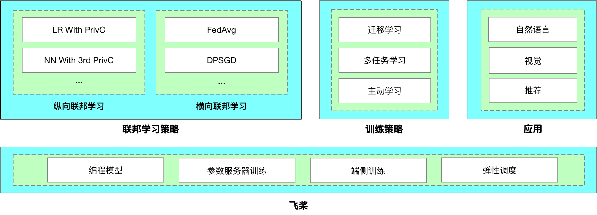
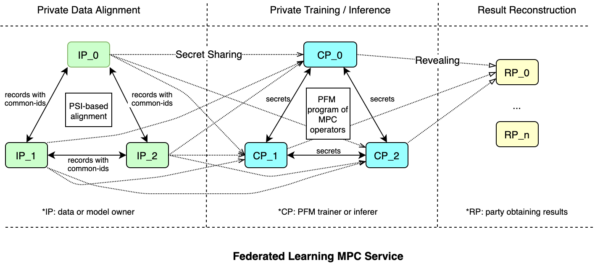

[English](./README.md) | 简体中文

[](https://github.com/PaddlePaddle/PaddleFL/releases)
[](LICENSE)

# PaddleFL

PaddleFL是一个基于PaddlePaddle的开源联邦学习框架。研究人员可以很轻松地用PaddleFL复制和比较不同的联邦学习算法，开发人员也比较容易在大规模分布式集群中部署PaddleFL联邦学习系统。PaddleFL提供很多种联邦学习策略（横向联邦学习、纵向联邦学习）及其在计算机视觉、自然语言处理、推荐算法等领域的应用。此外，PaddleFL还将提供传统机器学习训练策略的应用，例如多任务学习、联邦学习环境下的迁移学习。依靠着PaddlePaddle的大规模分布式训练和Kubernetes对训练任务的弹性调度能力，PaddleFL可以基于全栈开源软件轻松地部署。


## PaddleFL概述

如今，数据变得越来越昂贵，而且跨组织共享原始数据非常困难。联合学习旨在解决组织间数据隔离和数据知识安全共享的问题。联邦学习的概念由谷歌的研究人员提出[1，2，3]。PaddleFL 基于 PaddlePaddle 框架对联邦学习进行扩展实现。PaddleFL也提供了在自然语言处理，计算机视觉和推荐算法等领域的应用示例。PaddleFL支持当前主流两类联邦学习策略：横向联邦学习策略和纵向联邦学习策略[4]。未来会对联邦学习中的多任务学习[7]以及迁移学习[8]等进行开发和支持。

- **横向联邦学习策略**: 联邦平均 [2]，差分隐私 [6]，安全聚合[11]；
- **纵向联邦学习策略**: 基于privc[5]的两方训练，基于ABY3[10]的三方训练；




## PaddleFL框架设计

PaddleFL 中主要提供两种解决方案：**Data Parallel** 以及 **Federated Learning with MPC (PFM)**。

- 通过Data Parallel，各数据方可以基于经典的横向联邦学习策略（如 FedAvg，DPSGD等）完成模型训练。

- PFM是基于多方安全计算（MPC）实现的联邦学习方案。作为PaddleFL的一个重要组成部分，PFM可以很好地支持联邦学习，包括横向、纵向及联邦迁移学习等多个场景。既提供了可靠的安全性，也拥有可观的性能。

### Data Parallel

在PaddeFL中，模型训练的整体流程主要分为两个阶段：编译阶段和运行阶段。编译阶段主要定义联邦学习任务，运行阶段主要进行联邦学习训练工作，每个阶段主要包含的组件如下：


#### A. 编译阶段

- **FL-Strategy**: 用户可以使用FL-Strategy定义联邦学习策略，例如Fed-Avg[2]。

- **User-Defined-Program**: PaddlePaddle的程序定义了机器学习模型结构和训练策略，如多任务学习。

- **Distributed-Config**: 在联邦学习中，系统会部署在分布式环境中。分布式训练配置定义分布式训练节点信息。

- **FL-Job-Generator**: 给定FL-Strategy, User-Defined Program 和 Distributed Training Config，联邦参数的Server端和Worker端的FL-Job将通过FL Job Generator生成。FL-Jobs 被发送到组织和联邦参数服务器以进行联合训练。

#### B. 运行阶段

- **FL-Server**: 在云或第三方集群中运行的联邦参数服务器。

- **FL-Worker**: 参与联合学习的每个组织都将有一个或多个与联合参数服务器通信的Worker。

- **FL-Scheduler**: 训练过程中起到调度Worker的作用，在每个更新周期前，决定哪些Worker可以参与训练。

请参考更多的[例子](./python/paddle_fl/paddle_fl/examples), 获取更多的信息。

### Federated Learning with MPC

PaddleFL MPC 中的安全训练和推理任务是基于高效的多方计算协议实现的，PaddleFL支持三方安全计算协议ABY3[10]和两方计算协议PrivC[5]。基于PrivC的两方联邦学习主要支持线性/逻辑回归、DNN模型。基于ABY3的三方联邦学习线性/逻辑回归、DNN、CNN、FM等

在PaddleFL MPC中，参与方可分为：输入方、计算方和结果方。输入方为训练数据及模型的持有方，负责加密数据和模型，并将其发送到计算方（ABY3协议使用三个计算节点、PrivC协议使用两个计算节点）。计算方为训练的执行方，基于特定的多方安全计算协议完成训练任务。计算方只能得到加密后的数据及模型，以保证数据隐私。计算结束后，结果方会拿到计算结果并恢复出明文数据。每个参与方可充当多个角色，如一个数据拥有方也可以作为计算方参与训练。



PFM的整个训练及推理过程主要由三个部分组成：数据准备，训练/推理，结果解析。

#### A. 数据准备

- **私有数据对齐**： PFM允许数据拥有方（数据方）在不泄露自己数据的情况下，找出多方共有的样本集合。此功能在纵向联邦学习中非常必要，因为其要求多个数据方在训练前进行数据对齐，并且保护用户的数据隐私。
- **数据加密及分发**：在PFM中，提供在线或离线两种数据加密及分发方案。如果采用离线分发数据，那么数据方在数据准备阶段将数据和模型用秘密共享[9]的方法加密，然后用直接传输或者数据库存储的方式传到计算方。如果选择在线分发数据，数据方在训练过程中在线地对数据和模型进行加密和分发。在数据加密及分发过程中，每个计算方只会拿到数据的一部分，因此计算方无法还原真实数据。

#### B. 训练/推理

PFM 拥有与PaddlePaddle相同的运行模式。在训练前，用户需要定义MPC协议，训练模型以及训练策略。`paddle_fl.mpc`中提供了可以操作加密数据的算子，在运行时算子的实例会被创建并被执行器依次运行（训练过程中密文的通信支持gloo和grpc两种网络通信模式）。

请参考以下[文档](./docs/source/md/mpc_train_cn.md), 以获得更多关于训练阶段的信息。

#### C. 结果重构

安全训练和推理工作完成后，模型（或预测结果）将由计算方以加密形式输出。结果方可以收集加密的结果，使用PFM中的工具对其进行解密，并将明文结果传递给用户（目前数据的分片和重构支持离线和在线两种模式）。

请参考[MPC的例子](./python/paddle_fl/mpc/examples)，以获取更多的信息。


## 安装

### 环境依赖

* CentOS 7 (64 bit)
* Python 3.5/3.6/3.7/3.8 ( 64 bit) 
* pip3 9.0.1+ (64 bit)
* PaddlePaddle 1.8.5 
* Redis 5.0.8 (64 bit)
* GCC or G++ 8.3.1
* cmake 3.15+

### 安装部署

我们提供三种方式安装PaddleFL，您可以根据自己的实际情况进行选择：

1.在Docker中使用PaddleFL

我们**强烈建议** 您在docker中使用PaddleFL。

```sh
#Pull and run the docker
docker pull paddlepaddle/paddlefl:1.1.2
docker run --name <docker_name> --net=host -it -v $PWD:/paddle <image id> /bin/bash
```
Docker中环境配置以及paddlepaddle和paddlefl已经安装完成，您可以直接运行示例代码，开始使用PaddleFL。

2.安装包安装

我们提供了编译好的PaddlePaddle及PaddleFL安装包，您可以直接进行下载安装。

首先安装PaddlePaddle
```
#Install PaddlePaddle
wget https://paddlefl.bj.bcebos.com/paddlepaddle-1.8.5-cp**-cp**-linux_x86_64.whl
pip3 install paddlepaddle-1.8.5-cp**-cp**-linux_x86_64.whl
```

安装时，请将**替换成安装环境中的python版本。例如，如果您使用的python版本为python3.8，那么使用下面的命令：
```
wget https://paddlefl.bj.bcebos.com/paddlepaddle-1.8.5-cp38-cp38-linux_x86_64.whl
pip3 install paddlepaddle-1.8.5-cp38-cp38-linux_x86_64.whl
```

然后安装PaddleFL
```
#Install PaddleFL
pip3 install paddle_fl
```
上述命令会自动安装python3.8对应的PaddleFL。对于其他python3环境，您可以从 https://pypi.org/project/paddle-fl/1.1.2/#files 下载对应安装包手动安装。

3.源码安装
若您希望从源码编译安装，请点击[这里](./docs/source/md/compile_and_install_cn.md)。


如果使用gloo通信模型，需要用到redis，我们也提供了稳定的redis安装包, 可供下载。

```sh
wget --no-check-certificate https://paddlefl.bj.bcebos.com/redis-stable.tar
tar -xf redis-stable.tar
cd redis-stable &&  make
```

## Kubernetes简单部署

### 横向联邦方案

```sh
kubectl apply -f ./python/paddle_fl/paddle_fl/examples/k8s_deployment/master.yaml

```

请参考[K8S部署实例](./python/paddle_fl/paddle_fl/examples/k8s_deployment/README.md)

也可以参考[K8S集群申请及kubectl安装](./python/paddle_fl/paddle_fl/examples/k8s_deployment/deploy_instruction.md) 配置自己的K8S集群


## PaddleFL 相关扩展

### 联邦算法模拟器 (fl-mobile simulator)

[FL-mobile](./python/paddle_fl/mobile/) 是一个集移动端算法模拟调研、训练和部署为一体的框架。算法模拟器 (simulator) 是FL-mobile的一部分。

该模拟器的设计目的，是为了模拟实际线上多个移动端设备配合训练的场景。框架的设计思想在服务器上模拟数个端上设备，快速验证算法效果。模拟器的优势为：

- 支持单机和分布式训练
- 支持常见开源数据集的训练
- 支持模型中的私有参数和共享参数，私有参数不参与全局更新

## 正在进行的工作

- PFM支持更多的模型。
- 发布PFM的K8S部署方案。
- 手机端的联邦学习模拟器将在下一版本开源。

## 参考文献

[1]. Jakub Konečný, H. Brendan McMahan, Daniel Ramage, Peter Richtárik. **Federated Optimization: Distributed Machine Learning for On-Device Intelligence.** arXiv preprint 2016

[2]. H. Brendan McMahan, Eider Moore, Daniel Ramage, Blaise Agüera y Arcas. **Federated Learning of Deep Networks using Model Averaging.** arXiv preprint 2016

[3]. Jakub Konečný, H. Brendan McMahan, Felix X. Yu, Peter Richtárik, Ananda Theertha Suresh, Dave Bacon. **Federated Learning: Strategies for Improving Communication Efficiency.** arXiv preprint 2016

[4]. Qiang Yang, Yang Liu, Tianjian Chen, Yongxin Tong. **Federated Machine Learning: Concept and Applications.** ACM Transactions on Intelligent Systems and Technology 2019

[5]. Kai He, Liu Yang, Jue Hong, Jinghua Jiang, Jieming Wu, Xu Dong et al. **PrivC  - A framework for efficient Secure Two-Party Computation.** In Proc. of SecureComm 2019

[6]. Martín Abadi, Andy Chu, Ian Goodfellow, H. Brendan McMahan, Ilya Mironov, Kunal Talwar, Li Zhang. **Deep Learning with Differential Privacy.** In Proc. of CCS 2016

[7]. Virginia Smith, Chao-Kai Chiang, Maziar Sanjabi, Ameet Talwalkar. **Federated Multi-Task Learning**. In Proc. of NIPS 2017

[8]. Yang Liu, Tianjian Chen, Qiang Yang. **Secure Federated Transfer Learning.**  IEEE Intelligent Systems 2018

[9]. https://en.wikipedia.org/wiki/Secret_sharing

[10]. Payman Mohassel and Peter Rindal. **ABY3: A Mixed Protocol Framework for Machine Learning.** In Proc. of CCS 2018

[11]. Aaron Segal Antonio Marcedone Benjamin Kreuter Daniel Ramage H. Brendan McMahan Karn Seth K. A. Bonawitz Sarvar Patel Vladimir Ivanov. **Practical Secure Aggregation for Privacy-Preserving Machine Learning**.  In Proc. of CCS 2017

