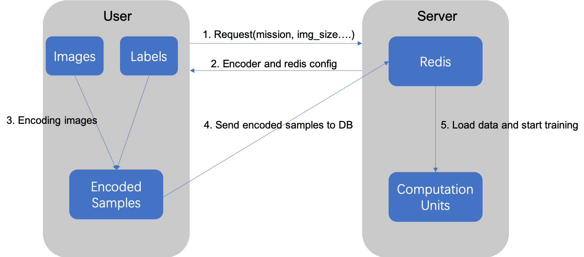

## Training process

- User send a request to server including task type, image size, etc.

- Server response a path for User where it can download the Encoder.

- User encode the images and send the processed data to DB after serialization.

- Server fetch the uploaded data and start training model.

## Start the service on Server side

"""

python server/receiver.py 

"""

## Start the request on User side 

"""
python submitter.py

"""

 
