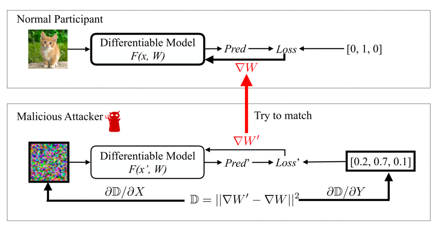
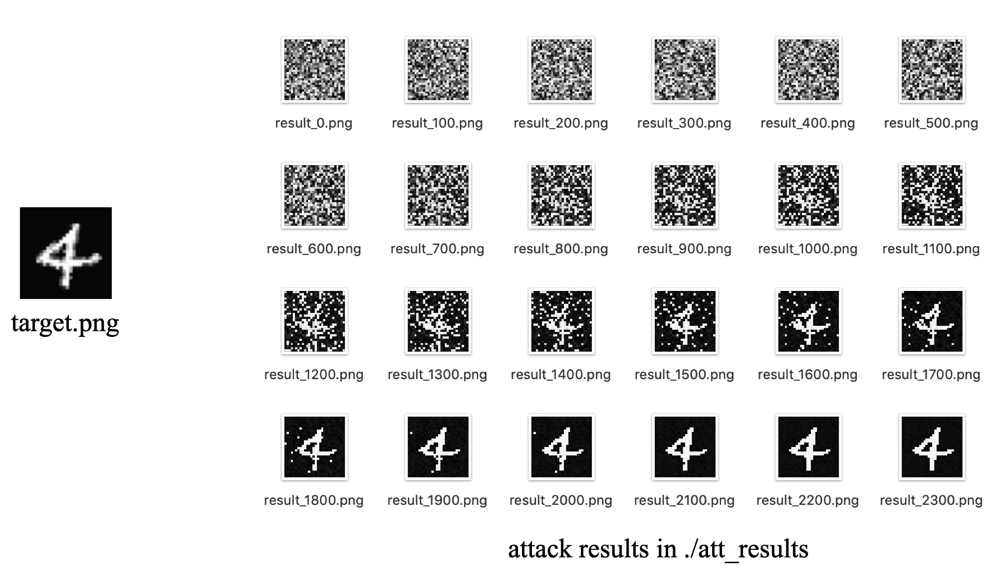

### 1. What is DLG?

#### 1.1 Background

In federated learning framework, users’ data are stored locally while only gradients of target model being transferred among different devices. This framework can prevent privacy leakage of these data and the model utility can benefit from abundant data of multiply users. However, recent research work showed that federated learning framework incurred severe privacy leakage, e.g., **Deep Leakage from Gradients (DLG) [1]**.

#### 1.2 Method

In DLG, in which attackers can steal accurate participant’s train data from the shared gradients. The workflow of DLG is shown as follow:



(1)  Target data (e.g., one picture of the victim’s training set) and label are sent into model **F**, and output gradients of model parameters &nabla;W. The attacker can obtain &nabla;W, for example, by downloading it from a parameter server in federated learning framework.

(2)  Dummy data and label generated randomly by the attacker.

(3)  Dummy data and label are sent into the same model **F** and also output gradients of model parameters &nabla;W'.

(4)  Define the square error of &nabla;W and &nabla;W' as a loss. Optimize the loss by updating dummy data and label with their gradients.

(5)  The attacker sends the updated dummy data and label into model **F** again. Repeat step 3-5 until results with small loss are obtained, i.e., the generated data is close to the original training data.


### 2. How to use this tool?

#### 2.1 Usage

Execute python script "`python mnist_example.py`". Optional arguments include:

```python
parser.add_argument('--use_gpu',
                    type=bool, default=False,
                    help='Whether to use GPU or not.')
parser.add_argument('--batch_size',
                    type=int, default=2,
                    help='The batch size of normal training.')
parser.add_argument('--iterations',
                    type=int, default=3000,
                    help='The iterations of attacking training.')
parser.add_argument('--learning_rate',
                    type=float, default=-8.5,
                    help='The learning rate of attacking training.')
parser.add_argument('--result_dir',
                    type=str, default='./att_results',
                    help='The directory for saving attack result.')
```

#### 2.2 Procedure of example of DLG attack on MNIST

As is show in "`mnist_example.py`", you can define the normal training process with PaddlePaddle as usual. What the difference is that at the first step of normal training, you should just obtain original gradients of model parameters generated by the original training data, and then pass the original gradients to the DLG module (in `dlg/dlg.py`) together with several arguments such as iterations, learning rate, feature variable, label variable, model network used for MNIST, the same executor with normal training, and the original gradients. Then the program would entrance the DLG attack module and generate effective attacking results in a defined directory.

#### 2.3 Result of DLG attack on MNIST

We use MNIST dataset to evaluate the effect and performance of DLG attack. A  figure of example is shown as following. The "`target.png"` in the left is the target picture, and the pictures in the right named with the format of "`result_NUM.png`" are the attacking results, where "`NUM`" means the number of attacking iterations. 

* **Effect**: As we can see, effective attacking result occurs after about 1700 attacking iterations. And the attacker is able to get almost the same result with target picture after 2100 attacking iterations.
* **Performance**: We use the default argument of attacking iterations, i.e., "`--iterations=3000`" to run "`mnist_example.py`" with CPU. The total time costed is about 12 seconds, which means that DLG attack is very efficient.




### 3. Requirements.

* **PaddlePaddle version** should be **1.7 or higher**.

* Normally, you can use Python 2.7 or 3.7, and we **recommend Python 3.7**.


#### Referances

[1] Zhu, L., Liu, Z., & Han, S. (2019). Deep leakage from gradients. In *Advances in Neural Information Processing Systems* (pp. 14747-14756).