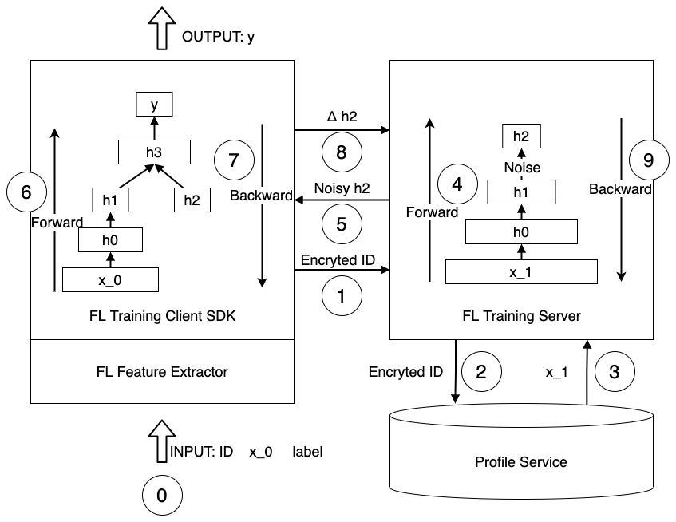

# Split Learning Design Doc

## 背景

SplitNN 使得不同的数据持有者（通常拥有不同维度的画像特征）能够在不暴露自有的数据情况下，协同训练模型。在每个训练阶段，参与者在本地训练并更新自己的网络部分，并只在必要时进行通信。在整个过程中，所有的中间变量会在传输前被加密。SplitNN只加密需要与客户端通信的隐向量，从而节省了大量的时间。

我们因为如下理由选择了SplitNN：

1. SplitNN 更高效：在同样的时间内可以训练更多数据。
2. SplitNN 支持更多模型：理论上支持所有PaddlePaddle的模型。
3. SplitNN 支持多种训练框架：中间变量使用grpc进行通信并且与框架解耦。

## 设计

我们的解决方案由如下三部分组成：
1. 客户端 SDK
2. 服务端
3. 特征服务

### 客户端 SDK
客户端SDK加密唯一用户识别码（UUID），推送到服务端，获得被加上噪声的（为了保护服务端的数据安全），由服务端利用服务端画像计算出来的隐向量 *h2* ，随后将 *h2* 和本地利用本地画像计算出来的 *h1* 进行连接获得 *h3*，去预测结果 *y* 。

为了执行反向网络，计算服务端的变量梯度，更新服务端参数，客户端SDK会将 *Δh2* 推送回服务端

客户端 SDK 支持如下特性：
1. 多语言支持：基于grpc。
2. 组建客户自定义网络：支持动态图模式和静态图模式，支持使用特定的key切分网络。
3. 支持稀疏特征抽取(TODO).

### Server
服务端获取加密后的ID，使用碰撞算法获取画像，并执行前向网络以计算出隐向量 *h2*，将其加噪后推送到客户端，随后服务端等待客户端计算过程结束并获取其响应结果，完成服务端剩下的反向网络计算。

服务端支持如下特性
1. 仅需要加密ID，从k-v数据服务中获取画像。
2. 支持grpc。
3. 组建自定义网络：支持动态图模式和静态图模式，支持使用特定的key切分网络。
4. 支持对隐向量 *h2* 加噪以保护用户隐私
5. 支持切分网络并分开执行
6. 支持多机分布式执行(TODO).

### Profile Service
传统的画像准备工作通常需要线性接近整个画像域的时间去过滤画像，而通常画像域的大小是亿级别的。

为了更快速地获取画像以支持服务端训练，我们组建了TB级别的画像服务。现在我们在小时级别更新画像，当客户端使用加密ID时，服务端可以命中多个画像主键，获取多方位的用户画像，而消耗的时间只有毫秒。
