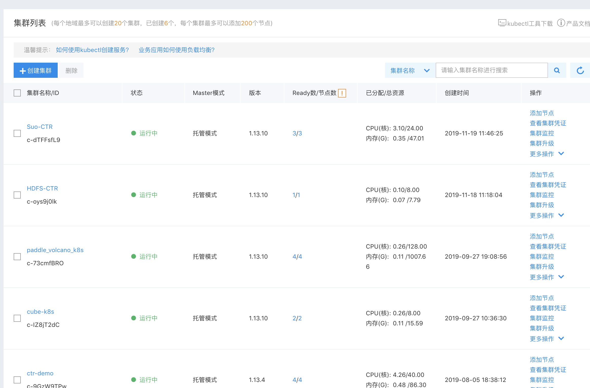

# K8S cluster application
Here is a guide for you to apply your K8S cluster on [Baidu Cloud](https://cloud.baidu.com/doc/CCE/s/zjxpoqohb)

The number of CPU cores should be larger than 8


# kubectl installation 
```sh
#download newest version
curl -LO "https://storage.googleapis.com/kubernetes-release/release/$(curl -s https://storage.googleapis.com/kubernetes-release/release/stable.txt)/bin/darwin/amd64/kubectl"
#add authorization for kubectl execution 
chmod +x ./kubectl
#move the execuable file to the enviroment path
sudo mv ./kubectl /usr/local/bin/kubectl
#check installation and get the version
kubectl version
```
# Add configuration for kubectl

After installing kubectl, we need to add some configurations for kubectl.

You can find the status of your cluster and download the certication [here](https://cloud.baidu.com/doc/CCE/index.html#.E6.9F.A5.E7.9C.8B.E9.9B.86.E7.BE.A4)



Finally, move the certification to default path of kubectl and you can access the remote K8S cluster on your machine

```sh
mv kubectl.conf  ~/.kube/config

kubectl get node
```
