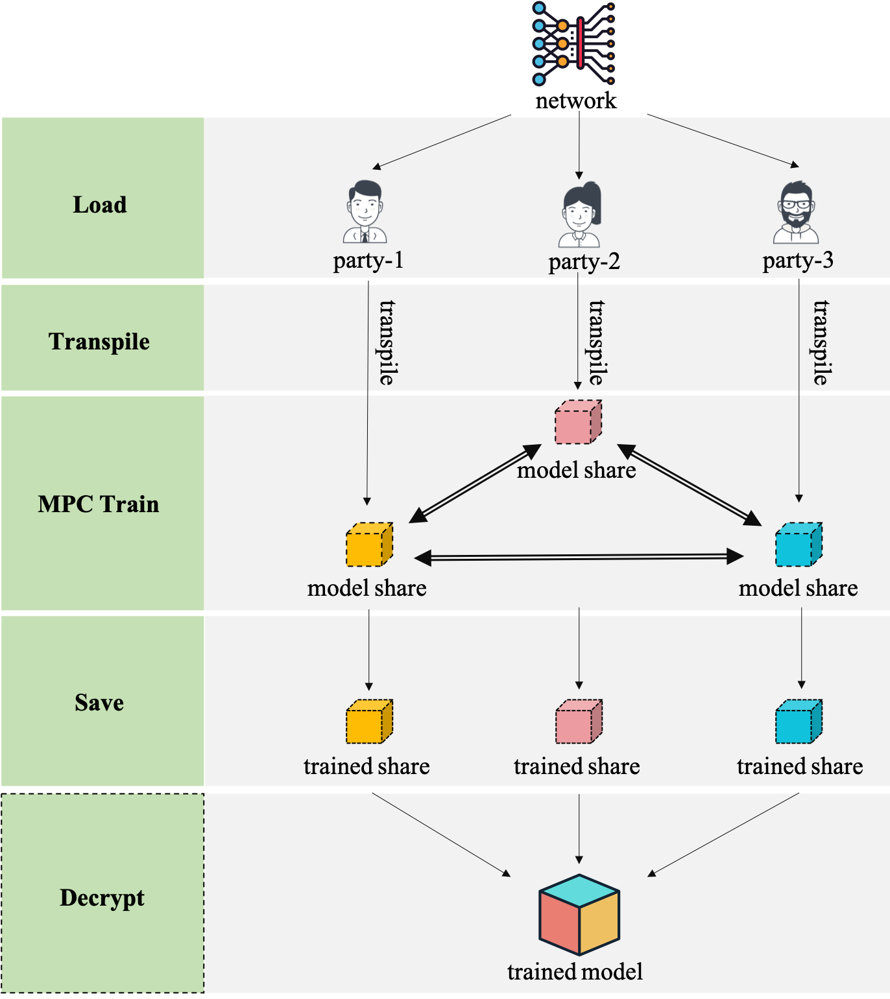
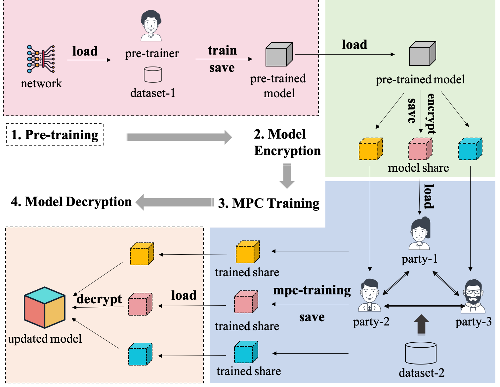
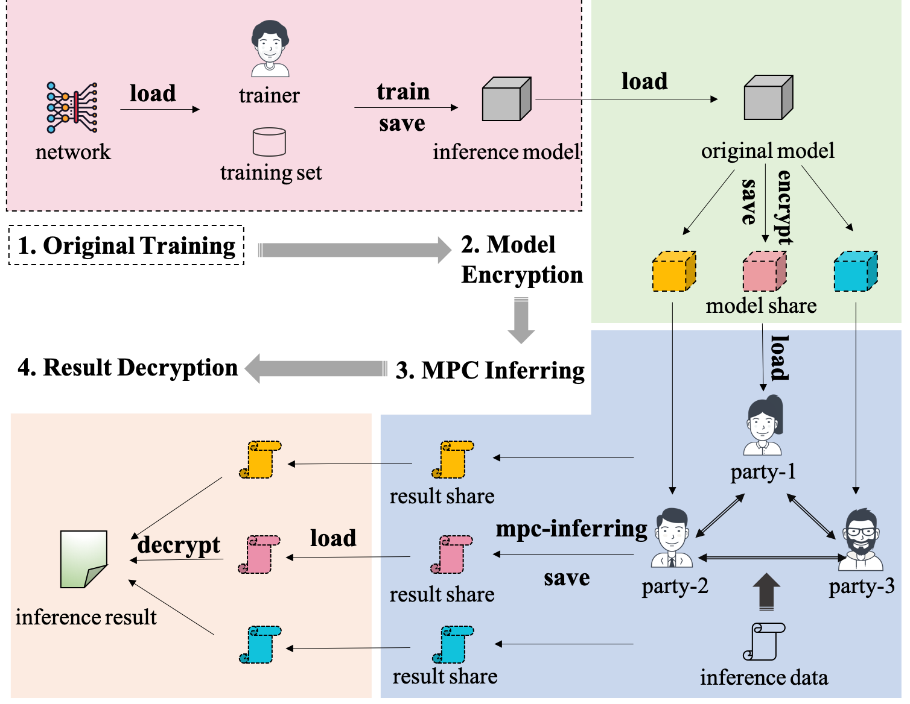

## 模型加密使用手册

(简体中文|[English](./README.md))

### 1. 介绍

基于Paddle-MPC提供的功能，用户可以实现对明文PaddlePaddle模型的加密，然后根据具体需求在加密的模型上使用密文数据进行模型的训练、更新或预测。因此，模型加密可以用于同时保护用户的训练数据和模型的场景。

### 2. 使用场景

根据用户的不同需求，模型加密的使用场景主要包括以下三种：

*  **模型加密后训练**

  多方用户使用各自数据联合进行已有空白模型的训练。在该场景下，各方用户可直接加载模型库中的空白网络模型或自定义的空白网络模型并对其进行加密，各方使用密文训练数据联合进行密文空白模型的训练和保存。训练完成后，各方只拥有密文模型，即明文模型的分片，在需要时可以基于模型分片解密恢复出完整的明文模型。

*  **预训练模型加密后再更新**

  多方用户使用各自新数据联合对现有的预训练模型进行更新。在该场景下，预训练的明文模型经过加密后分发给多方用户，各方用户使用新的密文训练数据联合进行密文模型的更新和保存。更新完成后，各方只拥有明文完整模型的分片，在需要时可以基于模型分片解密恢复出完整的明文模型。

*  **预训练模型加密后预测**

  多方用户使用预测模型对各自数据进行联合预测。在该场景下，明文预测模型经过加密后分发给多方用户，各方用户使用密文模型对密文数据作出联合预测。预测完成后，各方只拥有预测结果的分片，在需要时可以基于分片数据解密恢复出明文预测结果。

### 3. 使用方法

#### 3.1 加密训练新模型



使用Paddle-MPC进行模型加密训练的过程示意图如上，主要方法步骤如下：

1). **加载明文模型**：各方用户使用mpc_init OP初始化MPC环境，然后直接加载模型库中的网络模型或自定义的网络模型并完成参数的初始化。具体API用例为：

   ```python
   pfl_mpc.init("aby3", role, ip, server, port)
   [_, _, _, loss] = network.model_network()
   exe.run(fluid.default_startup_program())
   ```

2). **模型转换**（加密）：各方使用Paddle-MPC提供的模型转换接口`aby3.transpile`，将明文模型转换（加密）成密文模型。具体API用例为：

   ```python
   aby3.transpile()
   ```

3). **联合训练**：各方使用密文训练数据联合进行密文模型的训练。具体API用例为：

   ```python
   for epoch_id in range(epoch_num):
       for mpc_sample in loader():
           mpc_loss = exe.run(feed=mpc_sample, fetch_list=[loss.name])
   ```

4). **模型保存**：训练完成后，各方使用`aby3.save_trainable_model`接口保存训练好的密文模型。具体API用例为：

   ```python
   aby3.save_trainable_model(exe=exe,
                             model_dir=model_save_dir,
                             model_filename=model_filename)
   ```

5). **模型解密**：如有需要，模型解密需求方从各方获取保存的密文模型，使用Paddle-MPC提供的模型解密功能解密恢复出明文模型。具体可参考`model_decryption`目录中的介绍。

#### 3.2 模型更新



使用Paddle-MPC进行模型加密更新的过程示意图如上，主要方法步骤如下：

1). **模型预训练**：使用明文数据完成明文模型的预训练，得到预训练模型并保存。该步骤由预训练模型拥有方执行，是进行模型加密前的预训练操作。

2). **模型加密**：预训练模型拥有方使用Paddle-MPC提供的模型加密接口`aby3.encrypt_model`将预训练模型进行加密。加密得到的三个密文模型（即明文模型分片）分别发送给三个模型更新方保存。具体API用例为：

   ```python
   # Step 1. Load pre-trained model.
   main_prog, _, _ = fluid.io.load_inference_model(executor=exe,
                                                   dirname=paddle_model_dir,
                                                   model_filename=model_filename)
   # Step 2. Encrypt pre-trained model.
   aby3.encrypt_model(program=main_prog,
                      mpc_model_dir=mpc_model_dir,
                      model_filename=model_filename)
   ```

3). **联合更新**：更新模型的三方使用mpc_init OP初始化MPC环境，然后使用Paddle-MPC提供的模型加载接口`aby3.load_mpc_model`加载保存的密文模型，基于密文模型和密文数据进行密文模型的更新并保存更新后的密文模型。具体API用例为：

   ```python
   # Step 1. initialize MPC environment and load MPC model into
   # default_main_program to update.
   pfl_mpc.init("aby3", role, ip, server, port)
   aby3.load_mpc_model(exe=exe,
                       mpc_model_dir=mpc_model_dir,
                       mpc_model_filename=mpc_model_filename)
   
   # Step 2. MPC update
   for epoch_id in range(epoch_num):
       for mpc_sample in loader():
           mpc_loss = exe.run(feed=mpc_sample, fetch_list=[loss.name])
   ```

4). **模型解密**：如有需要，模型解密需求方从各方获取保存的密文模型，使用Paddle-MPC提供的模型解密功能解密恢复出明文模型。

#### 3.3 模型预测



使用Paddle-MPC进行模型加密预测的过程示意图如上，主要方法步骤如下：

1). **模型训练**：使用明文数据完成明文预测模型的训练和保存。该步骤由预测模型拥有方执行。

2). **模型加密**：预测模型拥有方使用Paddle-MPC提供的模型加密接口`aby3.encrypt_model`将预测模型进行加密。加密得到的三个密文模型（即明文模型分片）分别发送给三个预测方保存。具体API用例同模型更新中的介绍。

3). **联合预测**：执行预测的三方使用mpc_init OP初始化MPC环境，然后使用Paddle-MPC提供的模型加载接口`aby3.load_mpc_model`加载密文预测模型，基于密文预测模型和密文数据进行预测并保存密文预测结果。具体API用例为：

   ```python
   # Step 1. initialize MPC environment and load MPC model to predict
   pfl_mpc.init("aby3", role, ip, server, port)
   infer_prog, feed_names, fetch_targets = 
   						aby3.load_mpc_model(exe=exe,
                                   mpc_model_dir=mpc_model_dir,                                                    															  mpc_model_filename=mpc_model_filename, inference=True)
   
   # Step 2. MPC predict
   prediction = exe.run(program=infer_prog, feed={feed_names[0]: np.array(mpc_sample)}, fetch_list=fetch_targets)
   
   # Step 3. save prediction results
   with open(pred_file, 'ab') as f:
       f.write(np.array(prediction).tostring())
   ```

4). **结果解密**：预测结果请求方从各方获取保存的密文预测结果，使用Paddle-mpc提供的数据解密功能解密恢复出明文预测结果。

### 4. 使用示例

**模型训练**: 使用UCI Housing房价预测模型加密训练的示例，请见[这里](./train)。
**模型更新**: 使用UCI Housing房价预测模型加密更新的示例，请见[这里](./update)。
**模型预测**: 使用UCI Housing房价预测模型加密预测的示例，请见[这里](./predict)。

  


