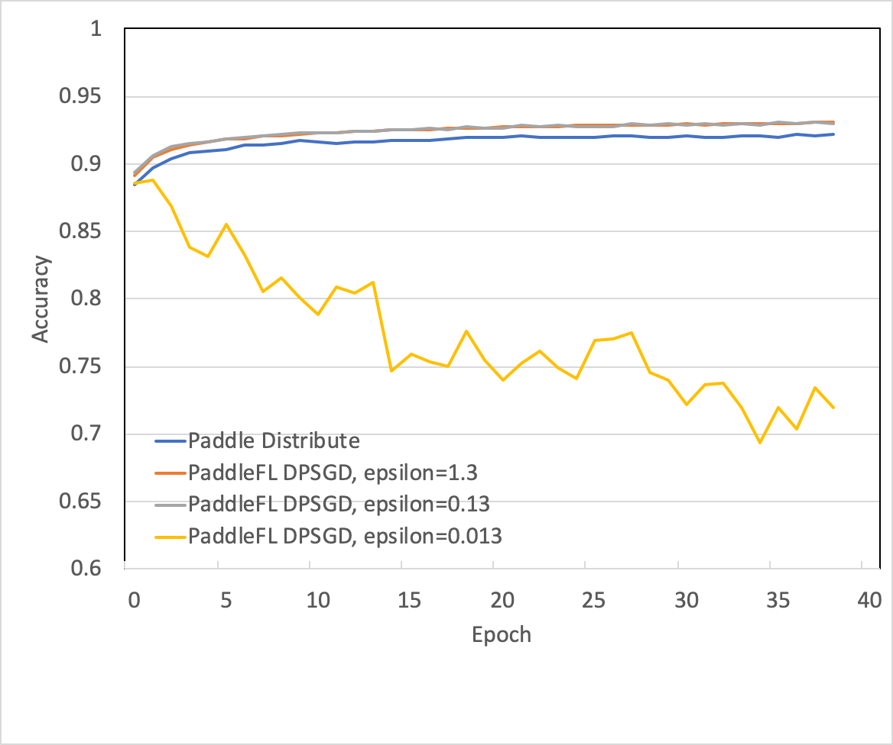

# Example in Recognize Digits with DPSGD

This document introduces how to use PaddleFL to train a model with Fl Strategy: DPSGD.

### Dependencies

- paddlepaddle>=1.8

### How to install PaddleFL

Please use pip which has paddlepaddle installed

```sh
pip install paddle_fl
```

### Model

The simplest Softmax regression model is to get features with input layer passing through a fully connected layer and then compute and ouput probabilities of multiple classifications directly via Softmax function [[PaddlePaddle tutorial: recognize digits](https://github.com/PaddlePaddle/book/tree/develop/02.recognize_digits#references)].

### Datasets

Public Dataset [MNIST](http://yann.lecun.com/exdb/mnist/)

The dataset will downloaded automatically in the API and will be located under `/home/username/.cache/paddle/dataset/mnist`:

| filename                | note                            |
| ----------------------- | ------------------------------- |
| train-images-idx3-ubyte | train data picture, 60,000 data |
| train-labels-idx1-ubyte | train data label, 60,000 data   |
| t10k-images-idx3-ubyte  | test data picture, 10,000 data  |
| t10k-labels-idx1-ubyte  | test data label, 10,000 data    |

### How to work in PaddleFL

PaddleFL has two phases , CompileTime and RunTime. In CompileTime, a federated learning task is defined by fl_master. In RunTime, a federated learning job is executed on fl_server and fl_trainer in distributed clusters.

```sh
sh run.sh
```

#### How to work in CompileTime

In this example, we implement compile time programs in fl_master.py

```sh
python fl_master.py
```

In fl_master.py, we first define FL-Strategy, User-Defined-Program and Distributed-Config. Then FL-Job-Generator generate FL-Job for federated server and worker.

```python
import paddle.fluid as fluid
import paddle_fl.paddle_fl as fl
from paddle_fl.paddle_fl.core.master.job_generator import JobGenerator
from paddle_fl.paddle_fl.core.strategy.fl_strategy_base import FLStrategyFactory
import math

class Model(object):
    def __init__(self):
        pass

    def lr_network(self):
        self.inputs = fluid.layers.data(name='img', shape=[1, 28, 28], dtype="float32")
        self.label = fluid.layers.data(name='label', shape=[1],dtype='int64')
        self.predict = fluid.layers.fc(input=self.inputs, size=10, act='softmax')
        self.sum_cost = fluid.layers.cross_entropy(input=self.predict, label=self.label)
        self.accuracy = fluid.layers.accuracy(input=self.predict, label=self.label)
        self.loss = fluid.layers.mean(self.sum_cost)
        self.startup_program = fluid.default_startup_program()


model = Model()
model.lr_network()

STEP_EPSILON = 0.1
DELTA = 0.00001
SIGMA = math.sqrt(2.0 * math.log(1.25/DELTA)) / STEP_EPSILON
CLIP = 4.0
batch_size = 64

job_generator = JobGenerator()
optimizer = fluid.optimizer.SGD(learning_rate=0.1)
job_generator.set_optimizer(optimizer)
job_generator.set_losses([model.loss])
job_generator.set_startup_program(model.startup_program)
job_generator.set_infer_feed_and_target_names(
    [model.inputs.name, model.label.name], [model.loss.name, model.accuracy.name])

build_strategy = FLStrategyFactory()
build_strategy.dpsgd = True
build_strategy.inner_step = 1
strategy = build_strategy.create_fl_strategy()
strategy.learning_rate = 0.1
strategy.clip = CLIP
strategy.batch_size = float(batch_size)
strategy.sigma = CLIP * SIGMA

# endpoints will be collected through the cluster
# in this example, we suppose endpoints have been collected
endpoints = ["127.0.0.1:8181"]
output = "fl_job_config"
job_generator.generate_fl_job(
    strategy, server_endpoints=endpoints, worker_num=2, output=output)
```

#### How to work in RunTime

```sh
python -u fl_scheduler.py >scheduler.log &
python -u fl_server.py >server0.log &
python -u fl_trainer.py 0 >trainer0.log &
python -u fl_trainer.py 1 >trainer1.log &
python -u fl_trainer.py 2 >trainer2.log &
python -u fl_trainer.py 3 >trainer3.log &
```
In fl_scheduler.py, we let server and trainers to do registeration.

```python
from paddle_fl.paddle_fl.core.scheduler.agent_master import FLScheduler

worker_num = 4
server_num = 1
#Define number of worker/server and the port for scheduler
scheduler = FLScheduler(worker_num, server_num, port=9091)
scheduler.set_sample_worker_num(4)
scheduler.init_env()
print("init env done.")
scheduler.start_fl_training()
```
In fl_server.py, we load and run the FL server job.  

```python
import paddle_fl.paddle_fl as fl
import paddle.fluid as fluid
from paddle_fl.paddle_fl.core.server.fl_server import FLServer
from paddle_fl.paddle_fl.core.master.fl_job import FLRunTimeJob

server = FLServer()
server_id = 0
job_path = "fl_job_config"
job = FLRunTimeJob()
job.load_server_job(job_path, server_id)
job._scheduler_ep = "127.0.0.1:9091"  # IP address for scheduler
server.set_server_job(job)
server._current_ep = "127.0.0.1:8181"  # IP address for server
server.start()
```

In fl_trainer.py, we load and run the FL trainer job, then evaluate the accuracy with test data and compute the privacy budget.  

```python
from paddle_fl.paddle_fl.core.trainer.fl_trainer import FLTrainerFactory
from paddle_fl.paddle_fl.core.master.fl_job import FLRunTimeJob
import numpy
import sys
import paddle
import paddle.fluid as fluid
import logging
import math

trainer_id = int(sys.argv[1]) # trainer id for each guest
job_path = "fl_job_config"
job = FLRunTimeJob()
job.load_trainer_job(job_path, trainer_id)
trainer = FLTrainerFactory().create_fl_trainer(job)
trainer.start()


def train_test(train_test_program, train_test_feed, train_test_reader):
        acc_set = []
        for test_data in train_test_reader():
            acc_np = trainer.exe.run(
                program=train_test_program,
                feed=train_test_feed.feed(test_data),
                fetch_list=["accuracy_0.tmp_0"])
            acc_set.append(float(acc_np[0]))
        acc_val_mean = numpy.array(acc_set).mean()
        return acc_val_mean

def compute_privacy_budget(sample_ratio, epsilon, step, delta):
    E = 2 * epsilon * math.sqrt(step * sample_ratio)
    print("({0}, {1})-DP".format(E, delta))

output_folder = "model_node%d" % trainer_id
epoch_id = 0
step = 0

while not trainer.stop():
    epoch_id += 1
    if epoch_id > 40:
        break
    print("epoch %d start train" % (epoch_id))
    for step_id, data in enumerate(train_reader()):
        acc = trainer.run(feeder.feed(data), fetch=["accuracy_0.tmp_0"])
        step += 1
    # print("acc:%.3f" % (acc[0]))

    acc_val = train_test(
        train_test_program=test_program,
        train_test_reader=test_reader,
        train_test_feed=feeder)

    print("Test with epoch %d, accuracy: %s" % (epoch_id, acc_val))
    compute_privacy_budget(sample_ratio=0.001, epsilon=0.1, step=step, delta=0.00001)

    save_dir = (output_folder + "/epoch_%d") % epoch_id
    trainer.save_inference_program(output_folder)
```


### Simulated experiments on public dataset MNIST

To show the effectiveness of DPSGD-based federated learning with PaddleFL, a simulated experiment is conducted on an open source dataset MNIST. From the figure given below, model evaluation results are similar between DPSGD-based federated learning and traditional parameter server training when the overall privacy budget *epsilon* is 1.3 or 0.13. 

 <br />
