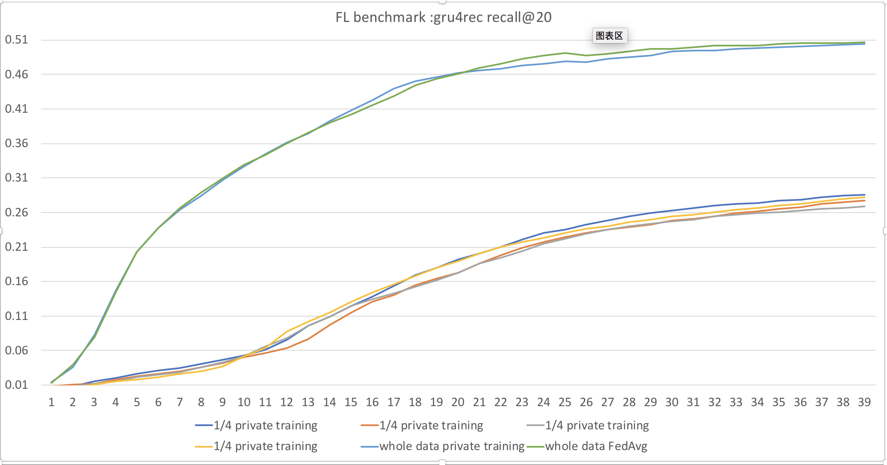

# Example in recommendation with FedAvg

This document introduces how to use PaddleFL to train a model with Fl Strategy.

### Dependencies
- paddlepaddle>=1.8

### How to install PaddleFL

Please use pip which has paddlepaddle installed
```sh
pip install paddle_fl
```

### Model
[Gru4rec](https://arxiv.org/abs/1511.06939) is a classical session-based recommendation model. Detailed implementations with paddlepaddle is [here](https://github.com/PaddlePaddle/models/tree/develop/PaddleRec/gru4rec).


### Datasets
Public Dataset [Rsc15](https://2015.recsyschallenge.com) 

```sh
#download data
sh download.sh
```

### How to work in PaddleFL
PaddleFL has two phases , CompileTime and RunTime. In CompileTime, a federated learning task is defined by fl_master. In RunTime, a federated learning job is executed on fl_server and fl_trainer in distributed clusters.

```sh
sh run.sh
```

### How to work in CompileTime
In this example, we implement compile time programs in fl_master.py
```sh
# please run fl_master to generate fl_job
python fl_master.py
```
In fl_master.py,  we first define FL-Strategy, User-Defined-Program and Distributed-Config. Then FL-Job-Generator generate FL-Job for federated server and worker.
```python
import paddle.fluid as fluid
import paddle_fl.paddle_fl as fl
from paddle_fl.paddle_fl.core.master.job_generator import JobGenerator
from paddle_fl.paddle_fl.core.strategy.fl_strategy_base import FLStrategyFactory

# define model
model = Model()
model.gru4rec_network()

# define JobGenerator and set model config
# feed_name and target_name are config for save model.
job_generator = JobGenerator()
optimizer = fluid.optimizer.SGD(learning_rate=2.0)
job_generator.set_optimizer(optimizer)
job_generator.set_losses([model.loss])
job_generator.set_startup_program(model.startup_program)
job_generator.set_infer_feed_and_target_names(
    [x.name for x in model.inputs], [model.loss.name, model.recall.name])

# define FL-Strategy , we now support two flstrategy, fed_avg and dpsgd. Inner_step means fl_trainer locally train inner_step mini-batch.
build_strategy = FLStrategyFactory()
build_strategy.fed_avg = True
build_strategy.inner_step = 1
strategy = build_strategy.create_fl_strategy()

# define Distributed-Config and generate fl_job 
endpoints = ["127.0.0.1:8181"]
output = "fl_job_config"
job_generator.generate_fl_job(
    strategy, server_endpoints=endpoints, worker_num=4, output=output)

```

### How to work in RunTime

```sh 
python -u fl_scheduler.py >scheduler.log &
python -u fl_server.py >server0.log &
python -u fl_trainer.py 0 >trainer0.log &
python -u fl_trainer.py 1 >trainer1.log &
python -u fl_trainer.py 2 >trainer2.log &
python -u fl_trainer.py 3 >trainer3.log &
```
fl_trainer.py can define own reader according to data. 
```python
r = Gru4rec_Reader()
train_reader = r.reader(train_file_dir, place, batch_size=10)
```

### Simulated experiments on real world dataset
To show the concept and effectiveness of horizontal federated learning with PaddleFL, a simulated experiment is conducted on an open source dataset with a real world task. In horizontal federated learning, a group of organizations are doing similar tasks based on private dataset and they are willing to collaborate on a certain task. The goal of the collaboration is to improve the task accuracy with federated learning. 

The simulated experiment suppose all organizations have homogeneous dataset and homogeneous task which is an ideal case. The whole dataset is from small part of [Rsc15] and each organization has a subset as a private dataset. To show the performanc e improvement under federated learning, models based on each organization's private dataset are trained and a model under distributed federated learning is trained. A model based on traditional parameter server training is also trained where the whole dataset is owned by a single organization.

From the table and the figure given below, model evaluation results are similar between federated learning and traditional parameter server training. It is clear that compare with models trained with only private dataset, models' performance for each organization get significant improvement with federated learning.

```sh
# download code and readme
wget https://paddle-zwh.bj.bcebos.com/gru4rec_paddlefl_benchmark/gru4rec_benchmark.tar
```

| Dataset | training methods | FL Strategy | recall@20|
| --- | --- | --- |---|
| the whole dataset | private training | -  | 0.504 |
| the whole dataset | federated learning | FedAvg | 0.504 | 
| 1/4 of the whole dataset | private training | - | 0.286 | 
| 1/4 of the whole dataset | private training | - | 0.277 | 
| 1/4 of the whole dataset | private training | - | 0.269 | 
| 1/4 of the whole dataset | private training | - | 0.282 | 

 <br />
